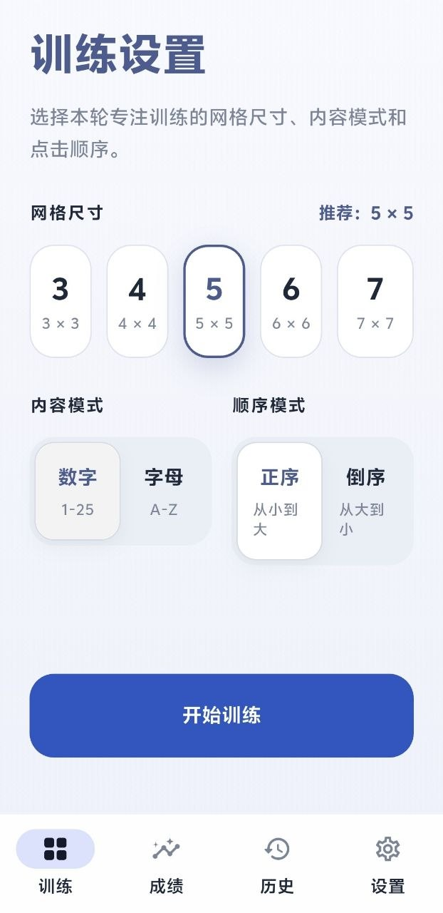

# 舒尔特方格

一个基于 Flutter 构建的中文舒尔特方格训练应用，聚焦注意力训练、视觉搜索与信息扫描速度提升。项目提供多种训练模式、实时成绩反馈、历史记录筛选、统计分析，以及本地 JSON 备份与恢复能力。



## 功能概览

- 多种训练组合：支持 `3 × 3` 到 `7 × 7` 网格，提供数字 / 字母两种内容模式，以及正序 / 倒序两种训练顺序。
- 实时训练反馈：训练过程中显示当前目标、已完成进度、用时、准确率，并支持暂停、继续和重新开始。
- 本地成绩沉淀：完成训练后自动保存记录，无需登录账号，也不依赖网络服务。
- 统计分析：按时间范围、内容模式、顺序模式和网格尺寸筛选数据，查看最佳成绩、平均用时、训练次数、趋势和稳定性。
- 历史记录追踪：按完成时间倒序查看每次训练结果，并保留模式、尺寸、用时、准确率和错误次数。
- 数据备份恢复：可将训练记录和主题配置导出为 JSON 文件，也可从备份文件恢复并覆盖本地数据。
- 主题模式切换：支持浅色、深色和跟随系统三种显示模式。

## 为什么这个项目有用

这个项目不是只做“点格子”的演示，而是围绕完整训练闭环设计：

- 开始前可快速配置训练参数，适合日常重复练习。
- 训练中强调低干扰和即时反馈，方便保持节奏。
- 训练后可以复盘个人表现，观察近期是否变快、是否更稳定。
- 数据完全保存在本地，适合个人长期积累，也便于迁移设备。

## 技术栈

- Flutter / Dart 3
- GetX：路由、依赖注入与状态管理
- Isar：训练记录本地数据库
- SharedPreferences：主题偏好持久化
- file_picker：备份文件导入与导出

## 项目结构

```text
lib/
├─ app/                # 应用入口、路由、主题、全局组件
├─ data/               # 数据库、仓储、备份服务、数据模型
├─ domain/             # 领域枚举与训练配置模型
└─ modules/
   ├─ home/            # 训练参数配置
   ├─ training/        # 训练流程与交互
   ├─ stats/           # 成绩统计与趋势分析
   ├─ history/         # 历史记录与筛选
   ├─ settings/        # 主题与数据备份
   └─ root/            # 底部导航容器

test/                  # 控制器、视图、服务和组件测试
DESIGN.md              # 设计系统说明
```

## 快速开始

### 环境要求

- Flutter SDK `^3.10.4`
- Dart SDK `^3.10.4`
- 可用的 Android 模拟器或真机

当前仓库已包含 Android 工程，可直接以 Flutter 标准方式运行。

### 安装依赖

```bash
flutter pub get
```

### 启动应用

```bash
flutter run
```

如果连接了多台设备，可以指定目标设备：

```bash
flutter run -d <device_id>
```

## 使用示例

1. 在“训练”页选择网格尺寸、内容模式和顺序模式。
2. 点击“开始训练”进入训练界面。
3. 首次点击任意格子后显示完整方格，同时开始计时。
4. 按界面提示依次点击目标内容，实时查看进度、用时和准确率。
5. 完成后前往“成绩”页查看汇总分析，或在“历史”页查看单次记录。
6. 如需迁移数据，可在“设置”页导出或恢复备份。

## 训练规则说明

- 数字模式支持更大的网格尺寸。
- 字母模式受 `A-Z` 数量限制，当前最多支持 `5 × 5`。
- 训练记录会在完成后自动写入本地数据库。
- 恢复备份会覆盖当前本地训练记录和应用配置。

## 数据存储与备份

- 训练记录使用 Isar 存储在应用文档目录。
- 主题模式使用 SharedPreferences 持久化。
- 备份文件为 JSON，包含版本号、创建时间、训练记录和主题配置。

## 维护与贡献

- 本项目由当前仓库所有者维护。
- 欢迎通过 Issue 或 Pull Request 提交改进。
- 提交代码前请确保 `flutter test` 通过，并在模型变更时同步提交生成文件。

## 开源许可

本项目基于 `MIT License` 开源，详见 `LICENSE`。